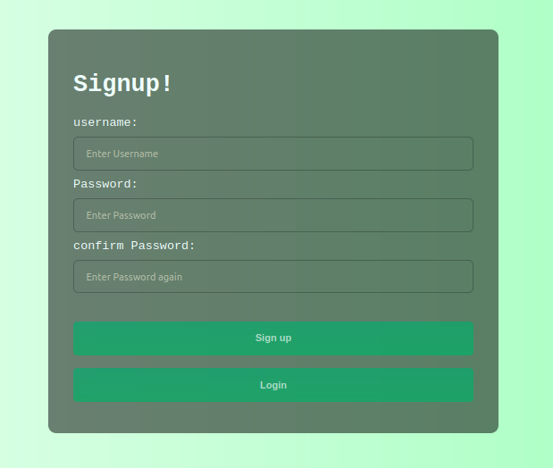
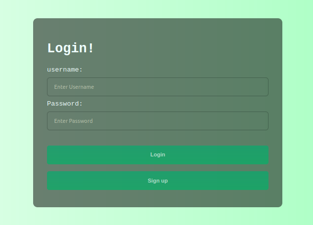
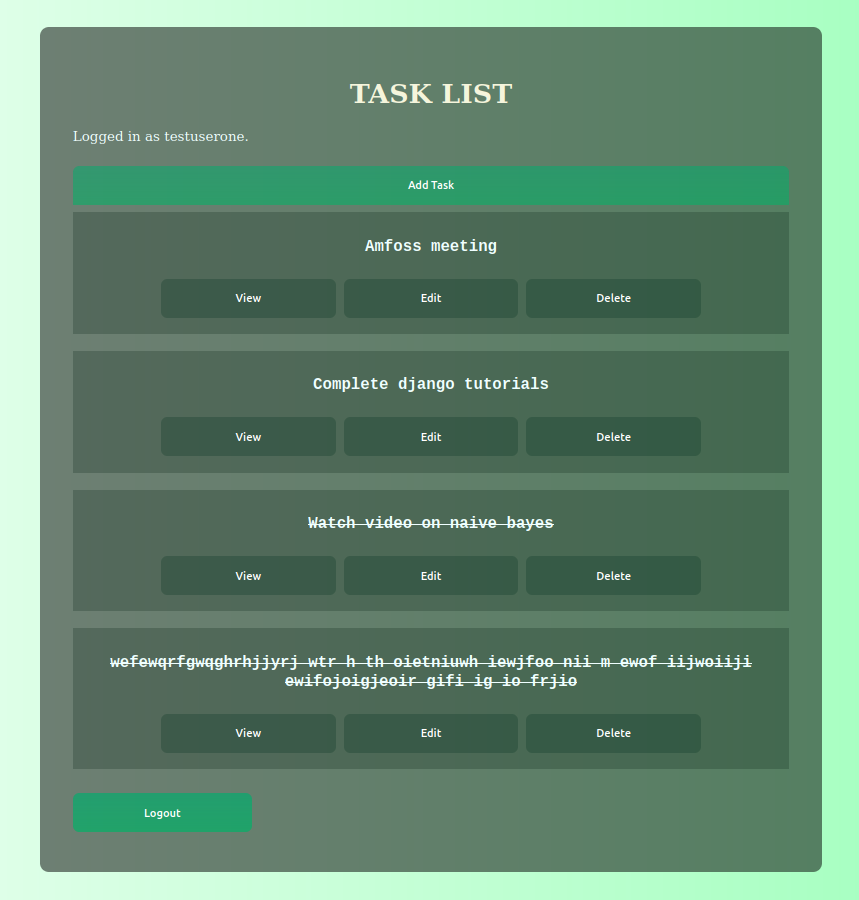
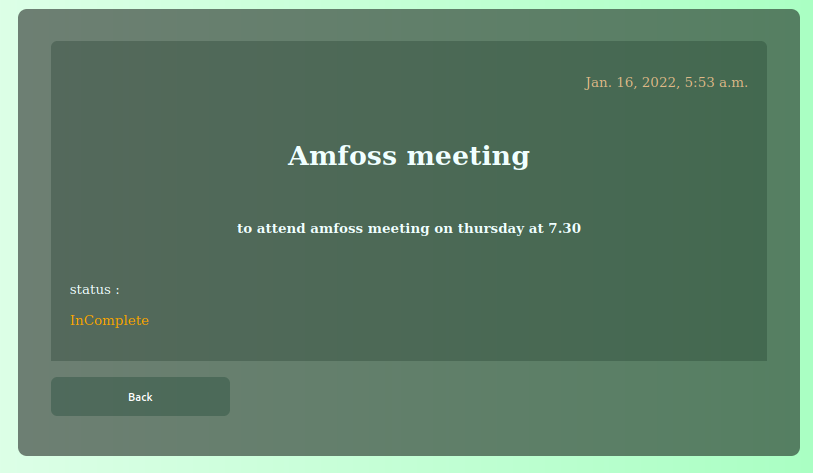
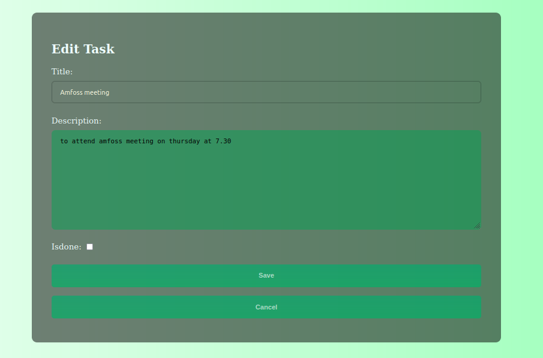
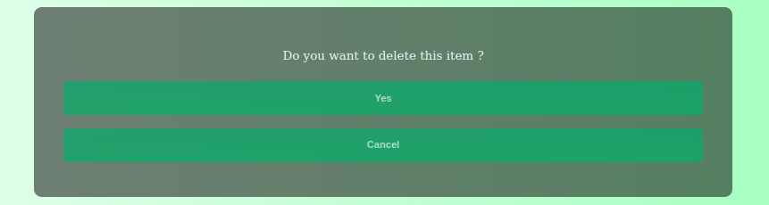

# TODOLIST-django

This is a base version of todolist app implementation using django. A lot of features are missing and is full of bugs. I will try to rectify it in coming days. I added few css and login page working kinda okay. Need to add generic and other stuffs. Need to avoid hardcording in most of the part. 

